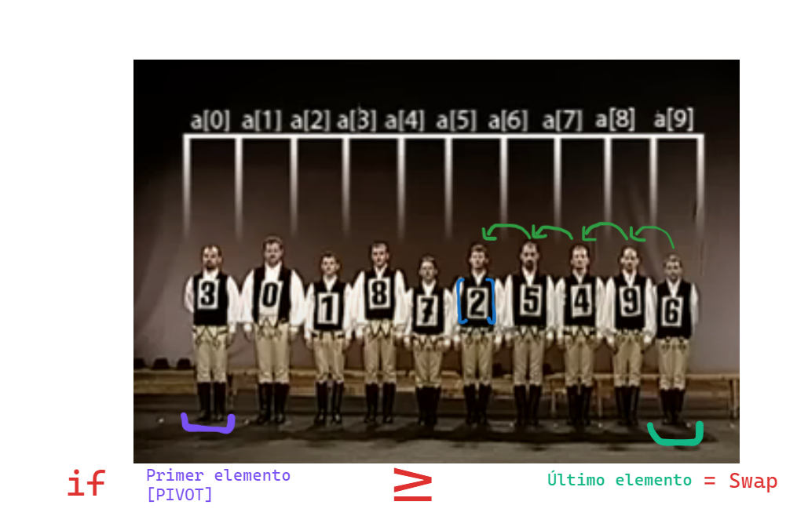
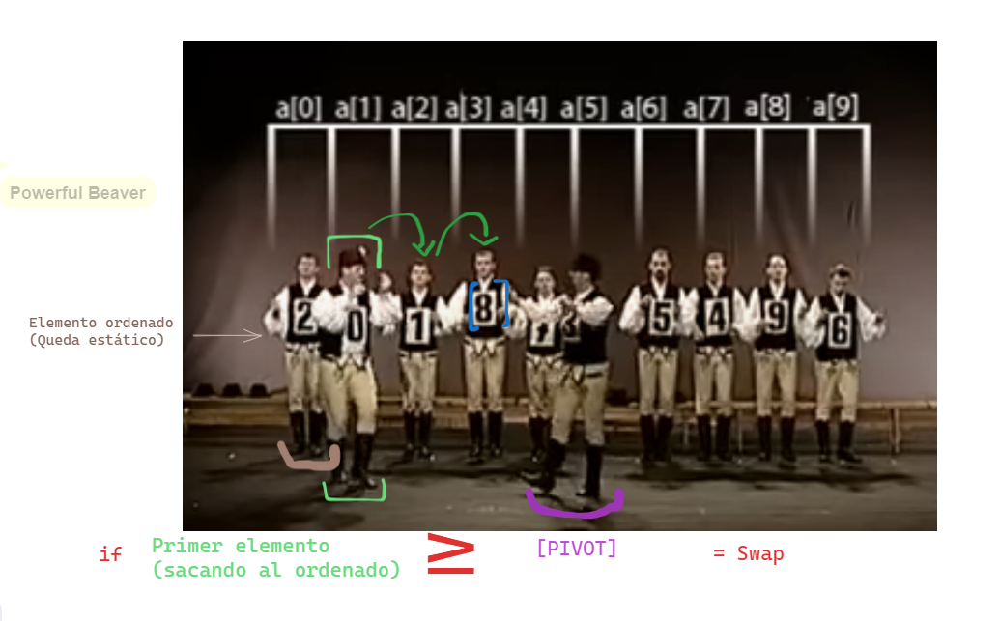
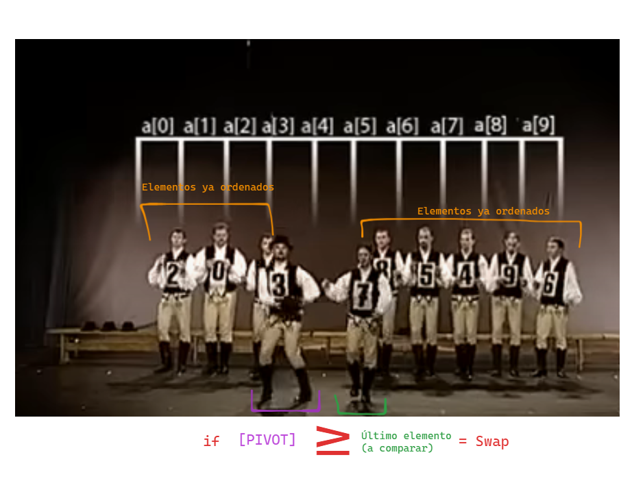
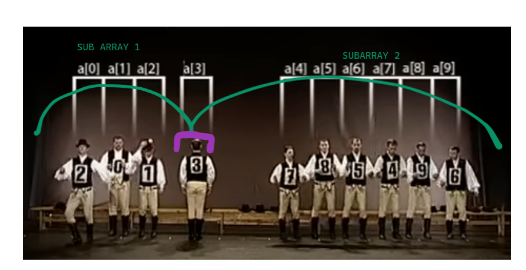
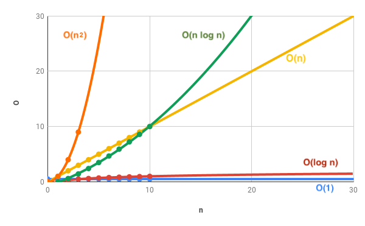
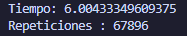
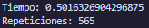

# Trabajo Práctico: Algoritmos de Ordenamiento.
 

## Integrantes :raising_hand:

-   Julián Alejandro Caceres
-   Justin Prado
-   Gabriel Alvarez Taibo
-   Franco Gatti

## Índice
- [Introducción.](#introducción)
- [Parte 1. Algoritmo Quick Sort.](#quicksort)
    - ¿Cómo funciona?
    - ¿Como emplear Quick Sort sin recursividad?
    - Diferencias entre Quick Sort con y sin recursividad.
- [Parte 2. Algoritmo Quick Sort Actvidad.](#hungarian_quicksort)
    - Comportamiento del pivot en la coreografía.
    - Comportamiento del pivot formalizado en un algoritmo de Python.
- [Parte 3. Análisis comparativo](#analisis)
- [Conclusión](#conclusion)

## 0. Introducción :page_with_curl: 

- El siguiente proyecto proporcionará información acerca de los algoritmos de ordenamiento trabajados en clase. Se analizará en profundidad el funcionamiento del "Quick Sort". Por otro lado, se desarrollará el algoritmo asignado en el video y se presentará un análisis acerca del mismo. Finalmente, se hará una conclusión redondeando todo lo visto.

## 1. Algoritmo QuickSort :1234:

### 1.1. ¿Cómo funciona el algoritmo de ordenamiento Quick Sort? :running:

- Quick Sort es un método que suele ser más rápido que los demás a la hora de ordenar elementos de un vector. 
- Implica tomar de un vector el ultimo de sus elementos para tomarlo con "pivot". De esta manera, el pivot divide el array entre los elementos iguales o menores que este, y los elementos mayores que este.

    

- Una vez dividido el array en "subarrays", se volverá a repetir este procedimiento: cada "pedacito" de la lista tomará como pivot el último de sus elementos y hará la comparación formando nuevos subarrays, hasta que el vector no tenga más elementos con los cuales compararse. 
#### :snake: Link al código de QuickSort:
- [Código](https://www.onlinegdb.com/AcAYk0fyi)

#### :scroll: Explicación paso a paso del código:
- Luego de definir el vector con elementos sin órden alguno, lo primero a hacer es llamar a la función quick_sort, la cual recibe tres parametros. Estos son: 
    - "array", siendo la lista en sí.
    - "low", como el primer elemento de la lista.
    - "high", como el último elemento de la lista. 

##### :hash:Función "quick_sort":
~~~ Python 
    def quick_sort(array, low, high):
    if low < high:
        pi = particionar(array, low, high) 
        quick_sort(array, low, pi - 1)
        quick_sort(array, pi + 1, high)
~~~ 
- Mientras el primer elemento sea menor en cantidad al último elemento (que low sea menor que high) se ejecutará el sorteamiento.
- Una vez se cumple esta condición, lo primero que hace esta función es llamar a otra: particionar, la cual recibe los mismos tres parámetros. Ésta es la encargada de realizar, como bien su nombre lo dice, las particiones al array a través de un pivot.

##### :hash:Función "particionar":
~~~ Python
    def particionar(array, low, high):
    pivote = array[high] #
    i = low - 1 
        
    for j in range(low, high):
        if array[j] <= pivote: 
            i += 1 
            array[i], array[j] = swap(array[i], array[j])
    
    array[i + 1], array[high] = swap(array[i + 1], array[high] ) 
    
    return i + 1
~~~

- El primer paso será establecer el último elemento del array como el pivote.
- Luego se creará una nueva variable "i", que será utilizada para realizar el swap. Esta misma toma el valor del primer elemento menos una unidad. Actúa como el índice de un elemento a ser intercambiado por otro más pequeño.
    - Swap se denomina al intercambio entre dos elementos de un vector.
- Lo siguiente que se realizará será un "recorrido" del vector, este será desde el primer elemento hasta el anteúltimo elemento, ya que el búcle "for" itera excluyendo el último valor asignado. Excluye, entonces, el pivot, ya que no necesitamos que se compare a sí mismo.
- Comparamos si los elementos son iguales o más pequeños que el pivot. Si se da la condición:
    -   A "i" se le suma 1 unidad.
    -   Se realizará el swap, a través de la función "swap":
        -   Del elemento en posición "i", con el elemento en posición "j" (el elemento recorrido que puede variar desde el primer elemento del vector hasta el anteúltimo).

    ##### :hash: Función "swap":
    ~~~ Python
    def swap(a,b):
    return b,a
    ~~~

- Pongamos en un ejemplo esto:
    - Tenemos la siguiente lista : [5,2,1,7,9,3]. El vector será [3].
    - i, sin entrar en la condicion del for, vale: "-1" (puesto a que el primer elemento se encuentra en posición "0", y a este se le resta -1).
    - Los elementos recorridos serán: [5,2,1,7,9].
    - [5] es más grande que el vector, no ingresa. Sin embargo, [2], el siguiente elemento, es más pequeño o igual que el vector. Se procede a hacer el swap.
    - Se intercambia el primer elemento [5] (porque i+1 = 0) con [2]. Quedará esto: [2,5,1,7,9,3].
    - Se encuentra otro número menor o igual que el vector: [1]. La variable "i" se le suma 1 y se realiza el swap de [5] con [1], porque ahora [5] se vuelve a encontrar en la posición "i" (1). Quedará: [2,1,5,7,9,3]. 
    
- Fuera del for, se corrige la posición del pivot, ya que solo ordenamos los elementos menores que este y los mayores a este. Necesitamos posicionar al pivot donde corresponde para que los subarrays luego tomen otro valor como pivot. La anteúltima línea intercambia la posición del elemento en posición "i" +  1,(que es un elemento más grande o igual que el pivot), con el pivot. Siguiendo el ejemplo visto, se intercambia el [5], ya que "i" pasa a valer 2. Ahora el pivot queda en el "medio": [2,1,3,7,9,5]. Así, se da por terminada la primera partición.

- La función "particionar" devuelve la posición del pivot (i+1). A partir de esta posición se llama de manera recursiva a la funcíon quick_sort para los subarrays menores o iguales al pivot y para los que son mayores a este.

##### :hash:Función recursiva "quick_sort"

~~~ Python
    quick_sort(array, low, pi - 1)
~~~
- En esta llamada se calcula el ordenamiento de los elementos menores o iguales al pivot, puesto a que el elemento máximo del subarray será la posición del pivot - 1.
- Se utilizamos el ejemplo anterior, la posición máxima será [1].

~~~ Python
    quick_sort(array, pi + 1, high)
~~~
- En esta llamada se calcula el ordenamiento de los elementos mayores, puesto a que la posición mínima del subarray será la posición del pivot + 1. Se excluirá al pivot y se ordenará hasta el último elemento, que será el nuevo pivot.
- En el ejemplo visto, la posición mínima será el [7], y la máxima el [5], siendo este último el nuevo pivot del subarray.

### 1.2. ¿Se puede realizar un algoritmo QuickSort sin utilizar recursividad? :repeat:

- Sí. Es posible desarrollar este algoritmo de sorteo excluyendo el uso de una función recursiva. Para ello podemos realizar una versión **iterativa** de este. Si bien parte del código se mantiene, por ejemplo el procedimiento para particionar y obtener la posición del pivot, debemos buscar otra manera de almacenar las llamadas y retornos de la función (quicksort) que se encargaba de guardar los "subarrays" generados.

- Entonces, para reemplazar a la pila (stack), donde se almacena memoria que contiene los retornos de la función, podemos crear una pila auxiliar, que sea del tamaño del vector, y que contenga los elementos a ser ordenados. Una vez ordenados, la pila estará vacía, pues no tendra nada más que ordenar:
##### :hash:Funcionamiento iterativo de QuickSort:
~~~ Python
def quicksort (array, low, high):
    pila = [0] * (len(array))     # Pila auxiliar
    tope = -1    #Inicializar el tope de pila:
    #Añadir el primer elemento y el último a la pila:
    tope = tope + 1
    pila[tope] = low
    tope = tope + 1
    pila[tope] = high
    while tope >= 0: #Se desapilan elementos de la pila mientras hayan.
        #Se sacan los valores del momento de low y high (en cada iteracion) de la pila (se hace un pop)
        high = pila[tope]
        tope = tope - 1
        low = pila[tope]
        tope = tope - 1

        p = particionar( array, low, high )  # Ordenamiento  / #p = pivot
        #Apilar para la izquierda de la pila
        if p-1 > low:
            tope = tope + 1
            pila[tope] = low
            tope = tope + 1
            pila[tope] = p - 1
        #Apilar para la derecha de la pila
        if p+1 < high:
            tope = tope + 1
            pila[tope] = p + 1
            tope = tope + 1
            pila[tope] = high
~~~
- En este código podría decirse que se "emula" el funcionamiento de la pila guardando la información de cada iteración en el montón (o heap) a través de una lista (pila auxiliar) que hace un seguimiento de los "subarrays" generados.

### Diferencias entre QuickSort recursivo y no recursivo :vs:

|         Diferencias      | qSort Recursivo | qSort Iterativo  |
| ------------- |:-------------:| :----------------:  |
|               |     Altos consumos de memoria (puede haber desbordamientos de pila).         |        El consumo está controlado (el heap es dinámico).             |
|               |      Su complejidad es menor. Claridad.                              | Su complejidad es mayor.
|                |      Ambas tienen un rendimiento similar.                               | Ambas tienen un rendimiento similiar. 

- Si bien ambos tienen rendimiento similar, hay que tener en cuenta que este mismo se puede ver afectado en el caso utilizar recursividad por el alto uso de memoria que se puede llegar a tener. Por otro lado, estos algoritmos pueden ser optimizados, porque hay casos donde los elementos del vector estan organizados de tal manera que se dan casos donde es necesario un mayor número de iteraciones/recursiones. Para ello se podria implementar, por ejemplo, que el pivot utilizado para las particiones sea aleatorio, así, en casos de grandes cantidades de elementos se puede llegar a reducir la carga.

## 2. Quick Sort (Hungarian folk dance method) 

- Para realizar un algoritmo que siga la coreografía del video asignado, nos basamos en la recursión utilizada en el punto 1. Sin embargo, la partición en este caso debe ser distinta, siguiendo los patrones que realiza el pivot en la coreografia de la danza húngara.

### Comportamiento del pivot en la coreografía

##### PRIMER PASO

- El primer paso que realiza el algoritmo de la función "particionar", es comparar el pivot, que alude al primer elemento del array (en este caso, "3"), con el último elemento. Si el pivot es menor que el último elemento, se realiza un intercambio entre estos. Como esto no sucede, el pivot se comparará con el elemento anterior a este último, yendo desde el final hacia el principio. El "swap" se realizará cuando "3" se compare con "2".

##### SEGUNDO PASO

- Luego el pivot, desde la posición anterior del "2", se compara con el elemento siguiente del ordenado (o sea, "0"). Se analiza si este elemento es mayor que el pivot, yendo desde atrás hacia adelante. Cuando esto suceda, se intercambian. En este caso, se hace un swap del 8 con el 3.

##### TERCER PASO

- El tercer paso es una réplica del primero, se aislan los elementos que fueron comparados por el pivot, y éste se compara con el último elemento (a ser comparado), si el pivot es menor que este, se hace el intercambio. Como esto no sucede, mantienen sus posiciones, y se da por terminado la primera partición, con dos subarrays resultantes.

##### RESULTADO PRIMER PARTICIÓN

### Implementación del comportamiento del pivot en un código de Python 

##### :hash: Inicialización de variables
[ array = [3, 0, 1, 8, 7, 2, 5, 4, 9, 6] ]
- El primer paso es inicializar las variables necesarias para realizar las comparaciones y ordenar:

~~~Python
def partition(array, low, high):
    pivot_index = low  # El primer indice será el indice del pivot
    pivot = array[pivot_index] # El primer elemento será el pivot
    izq = low + 1 # Izquierda: Elemento siguiente al pivot (Comparado con pivot luego de primer intercambio)
    der = high # Derecha: último elemento del array (donde se comienza a comparar)
~~~

- Luego inicializamos el while principal, que será un bucle infinito (while True), el cual se romperá en el caso de que se cumplan ciertas condiciones.

##### :hash: Primer paso de comparación

- El primer sector del algoritmo de partición, realiza la misma función que observamos en el primer paso del vídeo: 
    - Comienza a buscar un elemento menor al pivot (desde la derecha, es decir, desde el final), y, mientras no lo encuentre "der" se disminuye en 1. 
    - En el caso de que "der" sea menor a "izq", el bucle principal se rompe.
    - Si esta condición no se da, se procede a hacer el intercambio entre el índice con el elemento pivot(3), y el primer elemento menor a este (2). Por último, el indice con el elemento pivot toma el valor del índice del elemento intercambiado (2).

~~~ Python
        # Buscar desde el final hacia el inicio hasta encontrar un elemento menor que el pivot
        while der >= izq and array[der] >= pivot:
            der -= 1

        if der < izq:
            break

        # Intercambiar el pivot con el elemento menor encontrado
        swap(array, pivot_index, der)
        pivot_index = der # 
~~~

##### :hash: Segundo paso de comparación

- El segundo sector del algoritmo de partición, realiza el segundo paso de la coreografía:
    - Empieza comparando al elemento que se encuentra en la posición siguiente a la INICIAL del pivot, (en este caso, sería el 0), con el pivot en su posición actual. Mientras no se encuentre un elemento sobre la izquierda que sea mayor a pivot, "izq" aumentará en 1, es decir, irá buscando desde el principio hasta el final, hasta encontrar el número deseado (8, en este caso).
    - En el caso de que "izq" sea mayor a "der", el bucle principal se rompe.
    - Si esta condicion no se da, se hace el intercambio entre los elementos, y el indice del elemento pivot toma el valor del indice del elemento intercambiado (8).

~~~ Python
        # Buscar desde el inicio hacia el final hasta encontrar un elemento mayor que el pivote
        while izq <= der and array[izq] <= pivot:
            izq += 1

        if izq > der:
            break

        # Intercambiar el pivote con el elemento mayor encontrado
        swap(array, pivot_index, izq)
        pivot_index = izq
~~~

##### :hash: Reiteración del proceso anterior
-  El codigo volverá a analizar desde el principio, retomando el primer paso, si el elemento de posicion "der" (recordemos que esta variable fue disminuyendose) es menor que el pivot. Como no lo encuentra, porque compara al pivot [3] con [8] y [7],  llegara un punto donde "der" valga "2", esto hace que "izq" sea mayor, por lo que se rompe este bucle. Luego se vuelve a hacer la comparacion de izq con der, y como este último ahora es menor, el bucle principal se rompe: ya no hubo mas intercambios por hacer.

Array luego de la primera partición : [2,0,1,3,7,8,5,4,9,6]

La función, una vez que se encuentra fuera del bucle principal, retorna el índice del pivot. A través de este, se realizaran las recursiones que analizamos en el punto 1 del trabajo práctico:

- Se ordenan, por un lado, los elementos anteriores al pivot:
~~~Python
    qsort(array, low, pivot_index - 1) # El mayor elemento será [1] y el pivot [2]
~~~
- Se ordenan, por otro lado, los elementos posteriores al pivot:
~~~Python
    qsort(array, pivot_index + 1, high) # El elemento menor y el pivot será [7] 
~~~

## 3. Análisis comparativo con otros algoritmos de ordenamiento :signal_strength: 

Antes de comenzar con el análisis, es importante considerar el concepto de "complejidad temporal de un algoritmo". Este es, el número de operaciones que realiza un algoritmo para completar su tarea (considerando que cada operación dura el mismo tiempo). El algoritmo que realiza la tarea en el menor número de operaciones se considera el más eficiente en términos de complejidad temporal.

Para entenderlo hay varios elementos que intervienen. En principio: Orden de la operación de ordenamiento, representado con "O", y la cantidad de elementos que intervienen, representado con "n".

###### Comparación de tiempo y repeticiones utilizando un mismo array (medido en ms):
- BubbleSort:

- Quick Sort (Coreografía):

Casos como el del BubbleSort o SelectionSort, cada elemento es comparado con el resto de la colección para determinar el máximo valor. Pensemos en un bucle dentro de otro bucle. Entonces, si tenemos 4 elementos, el máximo de comparaciones a hacer será de 16 (4^2). Otros casos, tales como el de QuickSort, utilizan una complejidad expresada así: O(nlogn) (complejidad loglineal). O (nlogn) implica que las operaciones de registro ocurrirán n veces. El tiempo O(nlogn) es común en algoritmos recursivos o algoritmos de clasificación de árboles binarios.

### 3.1. Eficiencia en el caso promedio :eight_spoked_asterisk:

##### _QuickSort_: 

-   Tiene una complejidad de tiempo promedio de O(n log n), es decir, grandes conjuntos de datos de manera muy eficiente en comparación con otros algoritmos de ordenamiento. Lo que lo hace mucho más eficiente que Burbujeo y Selección para conjuntos de datos grandes.

##### _BubbleSort_: 

-   Tiene una complejidad de tiempo promedio de O(n^2) o mejor dicho, que tiene una complejidad de tiempo de ejecución que crece de forma cuadrática con respecto al tamaño del conjunto de datos. Lo que lo hace menos eficiente que QuickSort, especialmente para conjuntos de datos grandes.

##### _SelectionSort_: 

-   También tiene una complejidad de tiempo promedio de O(n^2), por lo que es menos eficiente que QuickSort en términos de tiempo de ejecución en conjuntos de datos grandes.

### 3.2. Eficiencia en el peor caso :eight_pointed_black_star:

##### _QuickSort_: 

-   Puede degradarse a O(n^2) en el peor caso si el pivote elegido divide la lista de manera desigual. Sin embargo, esto es poco probable en la práctica si se elige un pivote adecuado.

##### _BubbleSort_: 

-   Siempre tiene una complejidad de tiempo de O(n^2), ya que realiza un número cuadrático de comparaciones e intercambios.

##### _SelectionSort_: 

-   También siempre tiene una complejidad de tiempo de O(n^2), ya que realiza un número cuadrático de comparaciones y movimientos.

### 3.3. Estabilidad :on:

##### _QuickSort_:

-   No es estable, lo que significa que no necesariamente preserva el orden relativo de los elementos con valores iguales.

##### _BubbleSort_: 

-   Es estable, ya que solo intercambia elementos adyacentes si son inversos.

##### _SelectionSort_: 

-   No es estable, ya que puede cambiar el orden relativo de los elementos con valores iguales.

### 3.4. Uso de memoria :floppy_disk:

##### _QuickSort_: 

-   Quick Sort es un algoritmo recursivo, por lo que tiene un uso de memoria adicional, el cual se debe a la pila de llamadas recursivas. El peor caso de uso de memoria se puede mitigar utilizando un pivot aleatorio, cosa que en nuestro algoritmo no ocurre, por lo que, en una situación de tener un array grande, donde las divisiones que hace el pivot sean poco eficientes, el consumo de memoria será alto.

##### _BubbleSort_: 

-   BubbleSort es un algoritmo in-place, lo que significa que no requiere espacio adicional significativo más allá del array de entrada. Utiliza una cantidad constante de memoria adicional para las variables temporales usadas en el intercambio de elementos.

##### _SelectionSort_: 

-   Selection Sort, al igual que Selection Sort, es un algoritmo in-place.

En resumen, QuickSort es generalmente más eficiente que BubbleSort y SelectiveSort en términos de tiempo de ejecución y es especialmente eficiente para conjuntos de datos grandes. Sin embargo, los algoritmos Burbujeo y Selección son más simples de implementar y pueden ser útiles para conjuntos de datos pequeños o en situaciones donde la eficiencia no es crítica. Si consideramos a la memoria como  una limitación crítica, estos dos últimos son superiores en comparación a QuickSort, debido a su uso constante de memoria adicional.

## Conclusión y reflexiones :bulb:  

- El trabajo realizado nos permitió identificar que, detrás de unas pocas líneas de código, se ejecutan una serie compleja de operaciones mátematicas que permiten resolver dilemas de todo tipo. Se podría decir que no existe un algoritmo "perfecto", al menos no en los analizados, ya que la eficiencia de estos, ya sea en tiempo de ejecución o administración de la memoria, depende de muchas variables. La longitud de elementos a analizar, el orden inicial de estos, el rango numérico que tienen o la memoria adicional dispuesta a utilizar son algunas de ellas.
- Por otro lado, encontramos que cada algoritmo tiene distintos grados de complejidad en cuanto a desarrollo y lectura del mismo. En general, el uso de recursividad en QuickSort facilita la lectura e implementación, a pesar de que por detrás se estén ejecutando instrucciones bastante complejas fuera de nuestro entendimiento. Respecto al algoritmo de la coreografía, en nuestro caso, el proceso que realiza la partición del array se hace más facil de entender y leer que el original asignado.

# ¡Gracias por leer!

<<<<<<< HEAD
=======
### 5.
## Ventajas:
    Eficiencia en el caso promedio: es conocido por su eficiencia en el caso promedio. Tiene una complejidad de tiempo promedio de O(n log n), es decir, que puede ordenar grandes conjuntos de datos de manera muy eficiente en comparación con otros algoritmos de ordenamiento.
    Baja sobrecarga adicional: tiende a tener una menor sobrecarga adicional debido a una menor cantidad de operaciones adicionales necesarias.
    In-place y uso eficiente de la memoria: puede ser implementado para ordenar la lista en su lugar, lo que significa que no requiere memoria adicional más allá de la lista que está siendo ordenada. Esto lo hace eficiente en términos de uso de memoria.
    Buen rendimiento en conjuntos de datos pequeños y medianos: es generalmente más rápido que otros algoritmos de ordenamiento en conjuntos de datos pequeños y medianos debido a su menor sobrecarga y menor complejidad constante.
## Desventajas:
    Complejidad en el peor caso: Aunque tiene una complejidad de tiempo promedio de O(n log n), en el peor caso puede degradarse a O(n^2), es decir, el tiempo de ejecución del algoritmo crece de forma cuadrática con respecto al tamaño del conjunto de datos. El pivote elegido dividiría la lista de manera desigual, lo que puede ocurrir si la lista ya está parcialmente ordenada o si el pivote elegido no es óptimo.
    No es estable: no preserva el orden relativo de los elementos con valores iguales. Esto significa que si hay elementos con el mismo valor en la lista de entrada, su orden relativo puede cambiar en la lista ordenada.
    En Conclusión, QuickSort es un algoritmo de ordenamiento eficiente en la mayoría de los casos, pero se debe tener cuidado con su implementación para evitar el peor caso de complejidad temporal y problemas similares.

###6.
##Conclusiones y reflexiones

    Si es posible, suele convenir utilizar QuickSort para ordenar arrays ya que ,cuando esta bien  implementado, no solo es el mas eficiente en  
    terminos de velocidad, si no que tambien es el que menos memoria utiliza. Pero si la cadena en si no es necesariamente largo, puede resultar mas
    conveniente usar otro metodo de ordenamiento mas simple de implementar.
>>>>>>> fa9017d955d6d4365b893241e045ecb137606d02
