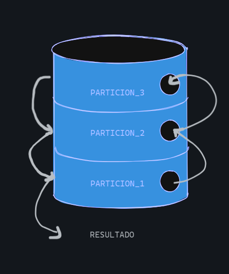

# Trabajo Práctico: Algoritmos de Ordenamiento.
 

## Integrantes :raising_hand:
- Julián Caceres

## Índice
- [Introducción.](#introducción)
- [Parte 1. Algoritmo Quick Sort.](#quicksort)
    - ¿Cómo funciona?
    - ¿Como emplear Quick Sort sin recursividad?
    - Diferencias entre Quick Sort con y sin recursividad.
- [Parte 2. Algoritmo Quick Sort Actvidad.](quicksort2)

## 0. Introducción :page_with_curl: 

- El siguiente proyecto proporcionará información acerca de los algoritmos de ordenamiento trabajados en clase. Se analizará en profundidad el funcionamiento del "Quick Sort". Por otro lado, se desarrollará el algoritmo visto en el video y se presentarán sus ventajas, desventajas...

## 1. Algoritmo QuickSort :1234:

### 1.1. ¿Cómo funciona el algoritmo de ordenamiento Quick Sort? :running:

- Quick Sort es un método que suele ser más rápido que los demás a la hora de ordenar elementos de un vector. 
- Implica tomar de un vector el ultimo de sus elementos para tomarlo con "pivot". De esta manera, el pivot divide el array entre los elementos iguales o menores que este, y los elementos mayores que este.

    

- Una vez dividido el array en "subarrays", se volverá a repetir este procedimiento: cada "pedacito" de la lista tomará como pivot el último de sus elementos y hará la comparación formando nuevos subarrays, hasta que el vector no tenga más elementos con los cuales compararse. 
#### :snake: Link al código de QuickSort:
- [Código](https://www.onlinegdb.com/AcAYk0fyi)

#### :scroll: Explicación paso a paso del código:
- Luego de definir el vector con elementos sin órden alguno, lo primero a hacer es llamar a la función quick_sort, la cual recibe tres parametros. Estos son: 
    - "array", siendo la lista en sí.
    - "low", como el primer elemento de la lista.
    - "high", como el último elemento de la lista. 

##### :hash:Función "quick_sort":
~~~ Python 
    def quick_sort(array, low, high):
    if low < high:
        pi = particionar(array, low, high) 
        quick_sort(array, low, pi - 1)
        quick_sort(array, pi + 1, high)
~~~ 
- Mientras el primer elemento sea menor en cantidad al último elemento (que low sea menor que high) se ejecutará el sorteamiento.
- Una vez se cumple esta condición, lo primero que hace esta función es llamar a otra: particionar, la cual recibe los mismos tres parámetros. Ésta es la encargada de realizar, como bien su nombre lo dice, las particiones al array a través de un pivot.

##### :hash:Función "particionar":
~~~ Python
    def particionar(array, low, high):
    pivote = array[high] #
    i = low - 1 
        
    for j in range(low, high):
        if array[j] <= pivote: 
            i += 1 
            array[i], array[j] = swap(array[i], array[j])
    
    array[i + 1], array[high] = swap(array[i + 1], array[high] ) 
    
    return i + 1
~~~

- El primer paso será establecer el último elemento del array como el pivote.
- Luego se creará una nueva variable "i", que será utilizada para realizar el swap. Esta misma toma el valor del primer elemento menos una unidad. Actúa como el índice de un elemento a ser intercambiado por otro más pequeño.
    - Swap se denomina al intercambio entre dos elementos de un vector.
- Lo siguiente que se realizará será un "recorrido" del vector, este será desde el primer elemento hasta el anteúltimo elemento, ya que el búcle "for" itera excluyendo el último valor asignado. Excluye, entonces, el pivot, ya que no necesitamos que se compare a sí mismo.
- Comparamos si los elementos son iguales o más pequeños que el pivot. Si se da la condición:
    -   A "i" se le suma 1 unidad.
    -   Se realizará el swap, a través de la función "swap":
        -   Del elemento en posición "i", con el elemento en posición "j" (el elemento recorrido que puede variar desde el primer elemento del vector hasta el anteúltimo).

    ##### :hash: Función "swap":
    ~~~ Python
    def swap(a,b):
    return b,a
    ~~~

- Pongamos en un ejemplo esto:
    - Tenemos la siguiente lista : [5,2,1,7,9,3]. El vector será [3].
    - i, sin entrar en la condicion del for, vale: "-1" (puesto a que el primer elemento se encuentra en posición "0", y a este se le resta -1).
    - Los elementos recorridos serán: [5,2,1,7,9].
    - [5] es más grande que el vector, no ingresa. Sin embargo, [2], el siguiente elemento, es más pequeño o igual que el vector. Se procede a hacer el swap.
    - Se intercambia el primer elemento [5] (porque i+1 = 0) con [2]. Quedará esto: [2,5,1,7,9,3].
    - Se encuentra otro número menor o igual que el vector: [1]. La variable "i" se le suma 1 y se realiza el swap de [5] con [1], porque ahora [5] se vuelve a encontrar en la posición "i" (1). Quedará: [2,1,5,7,9,3]. 
    
- Fuera del for, se corrige la posición del pivot, ya que solo ordenamos los elementos menores que este y los mayores a este. Necesitamos posicionar al pivot donde corresponde para que los subarrays luego tomen otro valor como pivot. La anteúltima línea intercambia la posición del elemento en posición "i" +  1,(que es un elemento más grande o igual que el pivot), con el pivot. Siguiendo el ejemplo visto, se intercambia el [5], ya que "i" pasa a valer 2. Ahora el pivot queda en el "medio": [2,1,3,7,9,5]. Así, se da por terminada la primera partición.

- La función "particionar" devuelve la posición del pivot (i+1). A partir de esta posición se llama de manera recursiva a la funcíon quick_sort para los subarrays menores o iguales al pivot y para los que son mayores a este.

##### :hash:Función recursiva "quick_sort"

~~~ Python
    quick_sort(array, low, pi - 1)
~~~
- En esta llamada se calcula el ordenamiento de los elementos menores o iguales al pivot, puesto a que el elemento máximo del subarray será la posición del pivot - 1.
- Se utilizamos el ejemplo anterior, la posición máxima será [1].

~~~ Python
    quick_sort(array, pi + 1, high)
~~~
- En esta llamada se calcula el ordenamiento de los elementos mayores, puesto a que la posición mínima del subarray será la posición del pivot + 1. Se excluirá al pivot y se ordenará hasta el último elemento, que será el nuevo pivot.
- En el ejemplo visto, la posición mínima será el [7], y la máxima el [5], siendo este último el nuevo pivot del subarray.

### 1.2. ¿Se puede realizar un algoritmo QuickSort sin utilizar recursividad? :repeat:

- Sí. Es posible desarrollar este algoritmo de sorteo excluyendo el uso de una función recursiva. Para ello podemos realizar una versión **iterativa** de este. Si bien parte del código se mantiene, por ejemplo el procedimiento para particionar y obtener la posición del pivot, debemos buscar otra manera de almacenar las llamadas y retornos de la función (quicksort) que se encargaba de guardar los "subarrays" generados.

- Entonces, para reemplazar a la pila (stack), donde se almacena memoria que contiene los retornos de la función, podemos crear una pila auxiliar, que sea del tamaño del vector, y que contenga los elementos a ser ordenados. Una vez ordenados, la pila estará vacía, pues no tendra nada más que ordenar:
##### :hash:Funcionamiento iterativo de QuickSort:
~~~ Python
def quicksort (array, low, high):
    pila = [0] * (len(array))     # Pila auxiliar
    tope = -1    #Inicializar el tope de pila:
    #Añadir el primer elemento y el último a la pila:
    tope = tope + 1
    pila[tope] = low
    tope = tope + 1
    pila[tope] = high
    while tope >= 0: #Se desapilan elementos de la pila mientras hayan.
        #Se sacan los valores del momento de low y high en cada iteracion almacenados en pila (se hace un pop)
        high = pila[tope]
        tope = tope - 1
        low = pila[tope]
        tope = tope - 1

        p = particionar( array, low, high )  # Ordenamiento  / #p = pivot
        #Apilar para la izquierda de la pila
        if p-1 > low:
            tope = tope + 1
            pila[tope] = low
            tope = tope + 1
            pila[tope] = p - 1
        #Apilar para la derecha de la pila
        if p+1 < high:
            tope = tope + 1
            pila[tope] = p + 1
            tope = tope + 1
            pila[tope] = high
~~~
- En este código podría decirse que se "emula" el funcionamiento de la pila guardando la información de cada iteración en el montón (o heap) a través de una lista (pila auxiliar) que hace un seguimiento de los "subarrays" generados.

### Diferencias entre QuickSort recursivo y no recursivo :vs:

Colons can be used to align columns.

|         Diferencias      | qSort Recursivo | qSort Iterativo  |
| ------------- |:-------------:| :----------------:  |
|               |     Altos consumos de memoria (puede haber desbordamientos de pila)         |        El consumo está controlado (el heap es dinámico)             |
|               |      Su complejidad es menor. Claridad.                              | Su complejidad es mayor
|                |      Ambas tienen un rendimiento similar                                | Ambas tienen un rendimiento similiar.